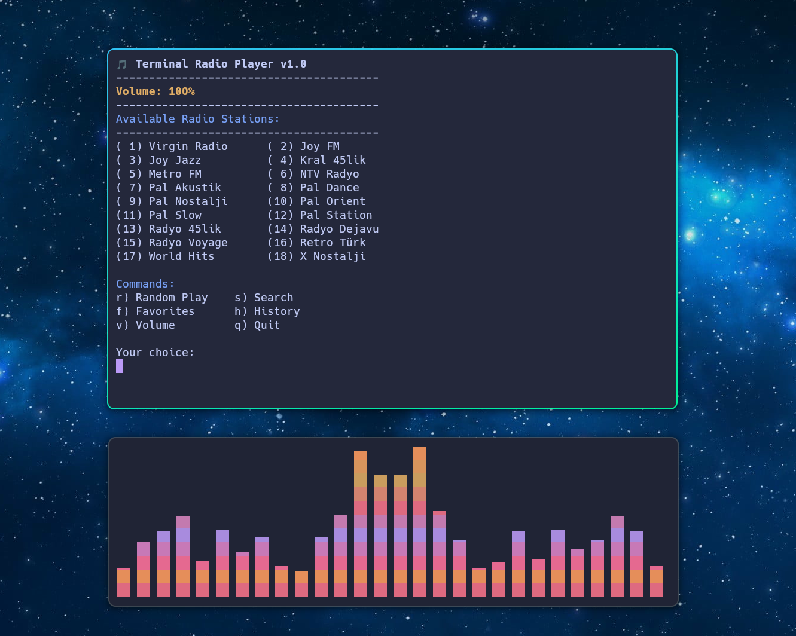

# tradio - Terminal Based Radio Player

A lightweight, terminal-based radio player that lets you listen to your favorite online radio stations without leaving the comfort of your terminal.



## Features

- 🎵 Simple and clean terminal user interface
- 📻 Support for multiple radio stations
- ⭐ Favorites system for quick access
- 📝 History tracking of played stations
- 🔊 Volume control integration
- 🔍 Search functionality
- 🎮 Support for both MPV and VLC players
- 🔄 Automatic dependency checking
- 📢 Desktop notifications
- 💻 Cross-platform compatibility
- 📦 Special support for NixOS environments

## Installation

### Prerequisites

Required:
- `bash`
- Either `mpv` or `vlc`

Optional:
- `libnotify` (for notifications)
- `pulseaudio` or `alsa` (for volume control)

### Basic Installation

```bash
# Clone the repository
git clone https://github.com/kenanpelit/tradio.git

# Enter the directory
cd tradio

# Make the script executable
chmod +x tradio

# Copy to your local bin directory
mkdir -p ~/.local/bin
cp tradio ~/.local/bin/

# Make sure ~/.local/bin is in your PATH
echo 'export PATH="$HOME/.local/bin:$PATH"' >> ~/.bashrc
```

### NixOS Installation

Add the following to your `configuration.nix` or home-manager configuration:

```nix
environment.systemPackages = with pkgs; [
  mpv
  vlc
  libnotify  # For notifications
  pulseaudio # For volume control
];
```

## Usage

Start the player by running:

```bash
tradio
```

### Controls

- Number keys (`1-20`): Select and play a radio station
- `r`: Play a random station
- `s`: Search for a station
- `f`: Access favorites
- `h`: View history
- `v`: Adjust volume
- `q`: Quit

## Configuration

tradio stores its configuration in `~/.config/tradio/`:

- `config`: General settings (volume, player preference)
- `history`: Record of played stations
- `favorites`: List of favorite stations

## Adding New Stations

To add new stations, edit the `RADIOS` array in the script:

```bash
RADIOS=(
    ["Station Name"]="http://stream.url/path"
    # Add more stations here
)
```

## Troubleshooting

### Common Issues

1. **No sound playing:**
   - Check if mpv/vlc is installed
   - Verify your system's audio settings
   - Test the stream URL directly with mpv/vlc

2. **Volume control not working:**
   - Ensure pulseaudio or alsa is installed
   - Check system permissions

3. **Notifications not showing:**
   - Install libnotify package
   - Ensure notification daemon is running

### NixOS Specific

If you're using NixOS, make sure:
1. Required packages are in your configuration
2. Audio services are properly configured
3. User is in appropriate groups

## Contributing

Contributions are welcome! Please feel free to submit a Pull Request.

## License

This project is licensed under the MIT License - see the [LICENSE](LICENSE) file for details.

## Acknowledgments

- Thanks to all radio stations for providing their streams
- Inspired by various terminal-based music players

## Support

If you encounter any issues or have suggestions:
1. Check the [Issues](https://github.com/kenapelit/tradio/issues) page
2. Create a new issue if needed
3. Provide as much detail as possible about your environment and the problem
